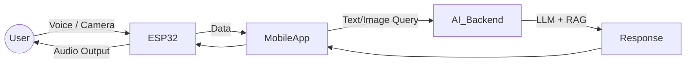

# 🥽 OptiAI Glasses

**AI-powered smart glasses for hands-free assistance**

OptiAI Glasses is a wearable system that integrates **ESP32-based smart glasses** with a **Flutter mobile app** and a **custom AI backend**.
The device enables **real-time object recognition, voice interaction, and knowledge retrieval** — designed to assist both visually impaired users and general users seeking a hands-free AI companion.

---

## ✨ Features

* 🎙️ **Voice Commands** – Hands-free speech-to-text and response via onboard microphone & speaker.
* 👁️ **Real-Time Object Recognition** – ESP32 camera + AI-powered object detection.
* 🤖 **LLM Integration** – Hybrid system using a local model (for fast responses) + cloud API (for complex queries) + intent classifier model
* 📚 **RAG System** – Retrieval-Augmented Generation for accurate object-related queries.
* 📚 **Real-time info** – Retrieval of real time info as user asked.
* 📱 **Flutter Mobile App** – Companion app for controlling settings, viewing logs, and managing data.
* 🔐 **Firebase Integration** – User authentication, query logging, and cloud data sync.
* 🌗 **Light/Dark Mode** – Seamless UI toggle in the mobile app.

---

## 🛠️ Tech Stack

### Hardware

* ESP32 (camera, microphone, speaker)
* Smart glasses frame with embedded components

### Software

* **Mobile App:** Flutter + Dart
* **Backend:** Node.js + Firebase + python
* **AI Models:**

  * Classifier (text or image based queries)
  * Intent Classifier (for real time queries)
  * Custom LLM (local + cloud integration)
  
* **Cloud:** Firebase (Auth, Firestore, Storage)

---

## 📐 System Architecture



---

## 🚀 Getting Started

### 1. Clone the Repository

```bash
git clone https://github.com/nad1r-Rao/OptiAI_FYP.git
cd OptiAI_FYP
```

### 2. Setup Flutter App

* Install Flutter SDK → [Flutter Install Guide](https://docs.flutter.dev/get-started/install)
* Install dependencies:

  ```bash
  flutter pub get
  ```
* Run the app:

  ```bash
  flutter run
  ```

### 3. Configure ESP32

* Flash the ESP32 with the firmware located in the `/esp32_firmware/` directory.
* Update your Wi-Fi credentials in the `env.h` file within the firmware code.
* Upload the firmware using the **Arduino IDE** or **PlatformIO**.

### 4. Firebase Setup

* Create a new project in the [Firebase Console](https://console.firebase.google.com/).
* Enable **Authentication** (Email/Password method) and **Firestore Database**.
* From your Firebase project settings, get your web app's Firebase configuration keys.
* Add these keys to the `FirebaseOptions` in `lib/main.dart`.

---

## 📂 Project Structure

The repository is structured as follows:

- **`lib/`**: Contains the main Dart source code for the Flutter application.
  - **`screens/`**: UI widgets for each screen of the app.
  - **`widgets/`**: Reusable UI components.
  - **`providers/`**: State management classes using the Provider package.
  - **`services/`**: Business logic, including AI and hardware communication.
  - **`models/`**: Data model classes.
  - **`theme/`**: App-wide theme, colors, and fonts.
  - **`config/`**: Environment and configuration settings.
- **`assets/`**: Images, fonts, and other static assets.
- **`esp32_firmware/`**: (Placeholder) The source code for the ESP32 device.
- **`test/`**: Unit and widget tests.

---

## 📸 Demo Screenshots

*in progress...*

---

## 📊 Roadmap

* [ ] Add multi-language speech support
* [ ] Improve real-time latency with edge processing
* [ ] Expand RAG system with custom datasets
* [ ] Release hardware assembly guide

---

## 🤝 Contributing

Contributions are welcome! Please fork the repo and submit a pull request.

---

## 📜 License

MIT License © 2025 **Nadir R**
