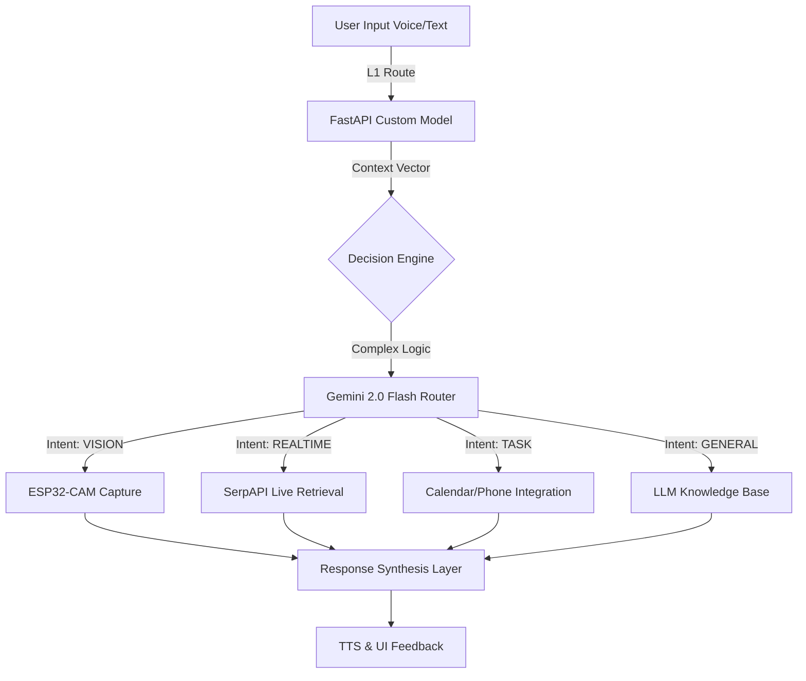

# 🕶️ OptiAI: Intelligent Wearable Core
> **A Hybrid-Intelligence Framework for Next-Gen Smart Glasses.**


## 📖 Executive Summary
**OptiAI** is a multimodal AI operating system designed for custom smart eyewear. It bridges the gap between low-power edge hardware (ESP32) and high-performance cloud intelligence (Gemini 2.0).

Unlike standard chatbots, OptiAI employs a **Hybrid Decision Engine** that intelligently routes queries between on-device logic, real-time web retrieval, and computer vision pipelines, minimizing latency while maximizing context awareness.

## 🏗️ System Architecture
OptiAI utilizes a **Two-Tier Intent Classification** system to ensure high-precision routing.


## 🚀 Key Technical Features

### 🧠 Hybrid Query Routing
* **L1 Intelligence:** Custom-trained FastAPI model for rapid, low-cost intent detection.
* **L2 Intelligence:** Gemini 2.0 Flash acts as the "Cortex," validating L1 predictions and handling complex reasoning (e.g., *"Look at this and tell me if it's healthy"*).

### 👁️ Multimodal Perception
* **Hardware Abstraction:** Direct HTTP integration with ESP32-CAM modules.
* **Vision Pipeline:** Raw image buffers (`Uint8List`) are processed in-memory and streamed to Gemini Vision for real-time OCR and object analysis.

### ⚡ Real-Time Knowledge Synthesis
* **Beyond Training Data:** Integrated **SerpAPI** for "Live Retrieval."
* **Anti-Hallucination:** A custom synthesis layer filters LLM output against retrieved snippets to ensure factual accuracy for news and weather.

### 🗣️ State-Aware Voice Interaction
* **Wake-Word Detection:** "Opti" trigger activates a dedicated listening state.
* **Auto-Sleep:** Privacy-focused state machine resets interactions after 30 seconds of silence.

---

## 🛠️ Technology Stack

| Domain | Technology | Role |
| :--- | :--- | :--- |
| **Client** | **Flutter** | Cross-platform UI & Hardware Management |
| **Core AI** | **Gemini 2.0 Flash** | Vision analysis & Complex Reasoning |
| **Routing** | **FastAPI** | Custom Classification Model & Proxy |
| **Edge** | **ESP32-CAM** | Visual Input & Sensor Data |
| **Backend** | **Firebase** | Auth, Firestore (Chat History), & Analytics |
| **Retrieval** | **SerpAPI** | Real-time Search Engine Results Page (SERP) |

---

## 🚦 Getting Started

### Prerequisites
* Flutter SDK
* Python 3.9+ (For FastAPI Service)
* ESP32-CAM Module (Flashed with generic CameraWebServer)

### 1. Environment Configuration
Create a `.env` file in the root directory:
```bash
GEMINI_API_KEY=your_key_here
SERP_API_KEY=your_key_here
MODEL_API_BASE=http://your_fastapi_server:8000
```
### 2. Launch the Decision Engine (Backend)
```bash
cd backend_service
uvicorn main:app --reload --host 0.0.0.0
```
### 3. Launch the Client
```bash
flutter pub get
flutter run
```
## 📂 Repository Structure
* `lib/services/`: External API integrations (Gemini, Serp, Firebase).
* `lib/providers/`: State management and Decision Engine logic.
* `lib/hardware/`: ESP32 connection and buffer handling.
* `backend/`: Python-based classification models.

---
*Authored with ❤️ by Nadir to the OptiAI community.*

